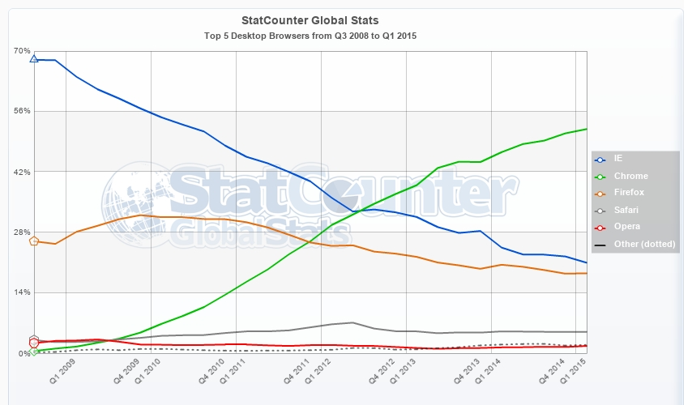

# Background

The Internet has a long and storied history, but over the past few decades the HyperText Transfer Protocol (`HTTP`) has remained one of the most popular transports for data communication.
`HTTP` (as well as the SSL-encrypted variant `HTTPS`) is the protocol that most web servers and browsers use to send data back and forth to each other.
When a browser makes an `HTTP` request to a web server, the web server then sends a response to the request.

## Server

Originally when clients made `HTTP` `GET` requests to load web pages, web servers would render the pages with all desired data present, and a new page would be requested with new content when data needed to be changed or updated.
This works quite nicely when a website is just a collection of static pages.
The pages may contain hyperlinks which, when clicked, take users to another page.
The user's browser client makes another request to the same server, which carries out the same process and responds with the new page content.

Server-side programming languages like PHP Hypertext Preprocessor (widely known by the recursive acronym `PHP`) can make this process much easier to develop.
Prior to such server-side languages, for example, web developers had to duplicate content on every static page just to have the same header and footer.
With `PHP` they are able to include files such as a header and footer on every page.
A more common approach eventually became to have a layout file which has the outside structure and shared content between, and include each specific page at a certain point within the layout template.
This method has been widely adopted by most modern web frameworks.
Although such techniques vastly improved the field of web development, they did so within the same confines of the static content era.

## AJAX

Such a call-and-response workflow is still typical today for such content as markup, scripts, stylesheets, and images.
As the need arose to load more dynamic data, however, better methods for loading in additional data were constructed.
With the popularization of `AJAX` starting in 1999, this familiar approach to sending and retrieving data was used in a very similar manner.
After the client loads a page, requests are made to obtain additional data as desired, without requiring a browser to refresh or change pages.
This lets developers tie into a model similar to how the browser loads scripts, stylesheets, and images (via `<script>`, `<link>`, and `` `HTML` tags, respectively), but for any arbitrary data.
The static content era ultimately evolved into one where data did not need to be present upon initial page loads, and could instead be populated asynchronously.

This era of dynamic content has not only greatly improved the workflow for typical websites, but it has also completely re-imagined what is possible.
Now that the web facilitates changing and refreshing data without loading entirely new pages, websites have been able to transcend their original purpose and become full-fledged applications.
Projects that were formerly only possible in the native operating system software world are now not only possible as web applications, but already a reality.

## WebSocket

In 2011, a standard was released for yet another method of transporting data between web servers and clients.
This protocol---known as the WebSocket protocol---allows for full-duplex communications channels over a single `TCP` connection [@websockets].
Clients open a bidirectional connection with a server which is not terminated after the typical request-response cycle.
Instead, the connection remains open, and either side may broadcast communications at any point.

In addition to bringing some newly conceivable workflows into fruition, the WebSocket protocol also made it possible to better some that were already achievable before its inception.
For instance, instead of a page making ten `AJAX` requests, it could receive all of the data from those ten requests through one single ongoing WebSocket connection.
Unfortunately the WebSocket protocol did not immediately flourish outside of a few niche areas, such as game development and multimedia applications.
This is likely due to Microsoft Internet Explorer not supporting it until version 10, which came out a year after the finalized WebSocket specification [@caniuse, *websockets*].
Even though Mozilla Firefox and Google Chrome had supported the protocol months before it was even finalized, in 2011 Internet Explorer still had the highest browser market share, and thus supporting it was deemed necessary by many developers [@statcounter].
This is market share is depicted in \autoref{fig:marketShare}.

